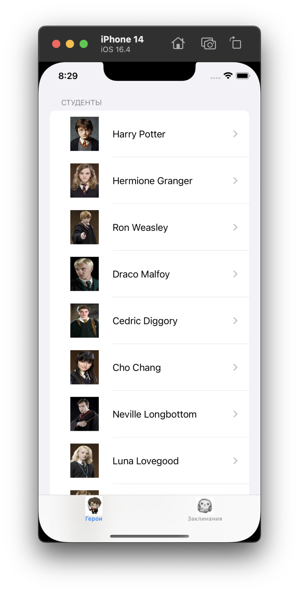
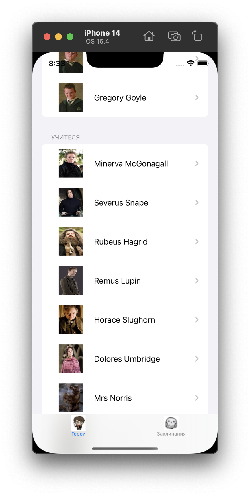
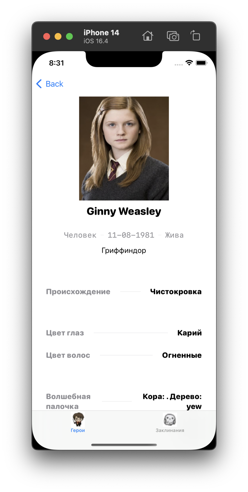
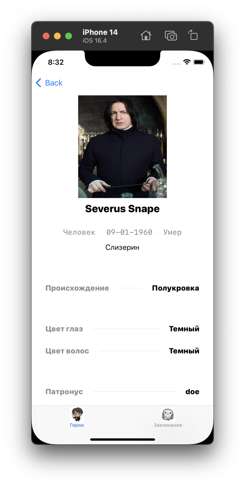
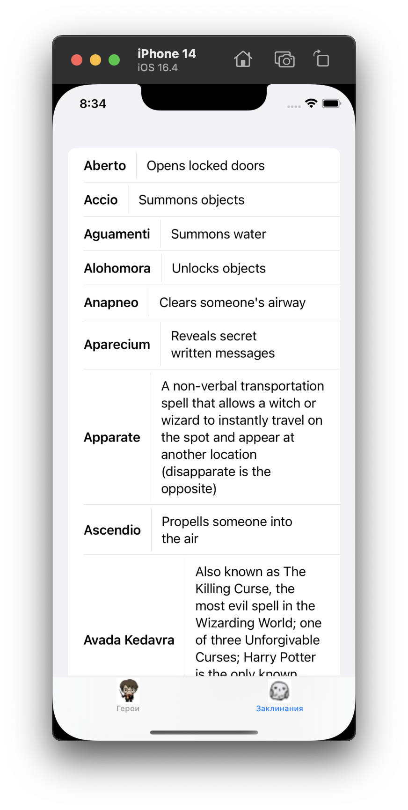
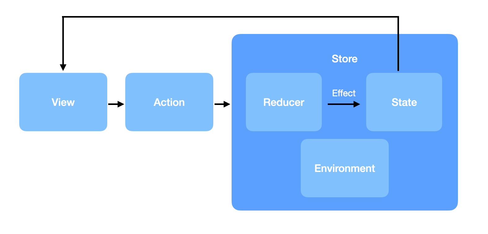

#  Проектная работа по курсу Otus на тему: "Информация по франшизе Гарри Поттера"

## Описание и цель создания

Приложение визуализирует основные данные по франшизе Гарри Поттера, собранные в открытом [апи](https://github.com/KostaSav/hp-api). Можно узнать основную информацию о героях франшизы и заклинаниях.
Целью создания является погружение во вселенную и апгрейд информационной базы о франшизе.

# Детали реализации приложения
На текущем этапе реализации в приложении можно просмотреть подробную информацию о героях и список заклинаний с описанием их действия.

Что реализовано сейчас:
1. Работа с апи вынесена в Package.
2. Получение данных из апи и отображение их на экранах.
3. Частичная локализация.

## Экраны

### Экран с героями

Экран базируется первой вкладке приложения на списке с героями, отсортированных по двум главным категориям: ученики и преподаватели Хогвартса.

### Экран с информацией о герое

Экран появляется после нажатия на одного из героя в списке и предоставляет информацио о нем:  вид, дату рождения, происхождение, внешний вид, актеру, игравшему роль, информацию о волшебной составляющей: палочке, патронусе.

### Экран с информацией по заклинаниям

Экран находится на второй вкладке приложения. По нажатию на нее отображается информация о заклинаниях в виде списка с названием заклинанием и описание его действия.

## Архитектура и стек

Архитектура: **Flux на основе TCA**.

Для загрузки картинок использовался `Kingfisher`.

Каждый экран имеет структуру: `Store`, `State`, `Action`, `Reducer`, `Environment`. 

С помощью `Store` инициируются реакции на смену `State`, пересылаемые с помощью `Action`. 
В `Reducer` обрабатываются все `Action` и запросы к апи, которые происходят с помощью `Environment`, а также меняются `State`.

## Дальнейшая судьба приложения

В планах доработать api для более полной информации о франшизе, сделать полную локализацию.
